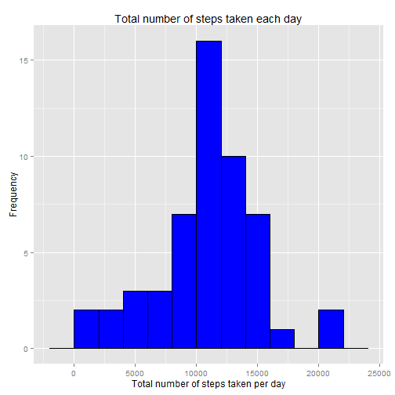
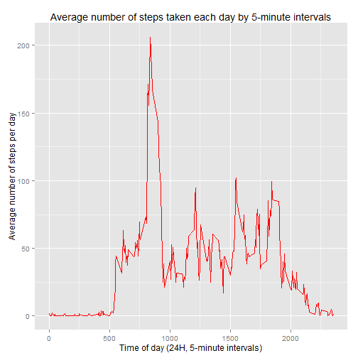
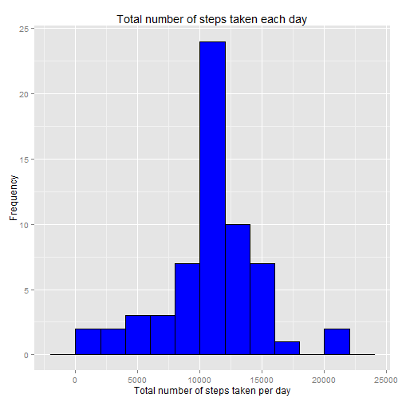
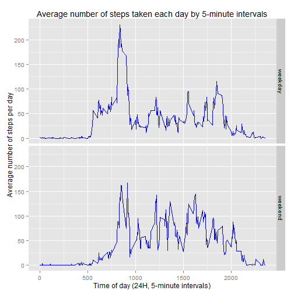

## Loading and preprocessing the data


```r
activity<-read.csv("activity.csv")
str(activity)
```

```
## 'data.frame':	17568 obs. of  3 variables:
##  $ steps   : int  NA NA NA NA NA NA NA NA NA NA ...
##  $ date    : Factor w/ 61 levels "2012-10-01","2012-10-02",..: 1 1 1 1 1 1 1 1 1 1 ...
##  $ interval: int  0 5 10 15 20 25 30 35 40 45 ...
```

```r
activity$steps<-as.numeric(activity$steps)
activity$date<-as.Date(as.character(activity$date,"%m/%d/%Y"))
activity$interval<-as.numeric(activity$interval)
```


## What is mean total number of steps taken per day?

###Total number of steps taken per day

The total number of steps taken per day is calculated and presented below, along with the first 10 records of the results.


```r
total_steps<-aggregate(steps~date,data=activity,sum,na.rm=TRUE)
head(total_steps,10)
```

```
##          date steps
## 1  2012-10-02   126
## 2  2012-10-03 11352
## 3  2012-10-04 12116
## 4  2012-10-05 13294
## 5  2012-10-06 15420
## 6  2012-10-07 11015
## 7  2012-10-09 12811
## 8  2012-10-10  9900
## 9  2012-10-11 10304
## 10 2012-10-12 17382
```

The histogram of the number of steps taken each day is drawn and presented below.


```r
library(ggplot2)
ggplot()+aes(total_steps$steps)+geom_histogram(binwidth=2000,colour="black",fill="blue")+xlab("Total number of steps taken per day")+ylab("Frequency")+ggtitle("Total number of steps taken each day")
```

 

The mean of the total number of steps taken per day is calculated as follows:


```r
mean(total_steps$steps,na.rm=TRUE)
```

```
## [1] 10766.19
```

The median of the total number of steps taken per day is calculated as follows:


```r
median(total_steps$steps,na.rm=TRUE)
```

```
## [1] 10765
```


## What is the average daily activity pattern?

The average number of steps taken for each time interval, across all days, is calculated as follows, along with the first 10 records of the result.


```r
average_steps<-aggregate(steps~interval,data=activity,mean,na.rm=TRUE)
head(average_steps,10)
```

```
##    interval     steps
## 1         0 1.7169811
## 2         5 0.3396226
## 3        10 0.1320755
## 4        15 0.1509434
## 5        20 0.0754717
## 6        25 2.0943396
## 7        30 0.5283019
## 8        35 0.8679245
## 9        40 0.0000000
## 10       45 1.4716981
```


Below is a time series plot of the 5-minute interval (x-axis) and the average number of steps taken, averaged across all days (y-axis).


```r
ggplot(average_steps,aes(interval,steps))+geom_line(color="red")+xlab("Time of day (24H, 5-minute intervals)")+ylab("Average number of steps per day")+ggtitle("Average number of steps taken each day by 5-minute intervals")
```

 

Which 5-minute interval, on average across all the days in the dataset, contains the maximum number of steps?


```r
average_steps$interval[which.max(average_steps$steps)]
```

```
## [1] 835
```


## Imputing missing values

The number of records with missing values in the dataset is calculated and reported below:


```r
sum(is.na(activity))
```

```
## [1] 2304
```

I have selected to replace the missing values by the mean for the relevant 5-minute interval, creating a new dataset in the process.

First, create a list of observations where:
(1) If number of steps is missing then replace by average number of steps for that 5-minute time interval across all days.
(2) If number of steps is not missing then do nothing.

This is done by looping through each record for the "activity"" dataset, and identifying each observation for number of steps, processing as described above.


```r
NAvalues<-numeric()
for (i in 1:nrow(activity)) {
    if(is.na(activity[i,]$steps)) {
        steps<-subset(average_steps,interval == activity[i,]$interval)$steps
    } else {
        steps<-activity[i,]$steps
    }
NAvalues<-c(NAvalues,steps)
}
```

Secondly, create a new dataset from "activity" called "activity_revised", and then replace the 'steps' column with the newly created 'NAvalues' column.


```r
activity_revised<-activity
activity_revised$steps<-NAvalues
head(activity_revised,10)
```

```
##        steps       date interval
## 1  1.7169811 2012-10-01        0
## 2  0.3396226 2012-10-01        5
## 3  0.1320755 2012-10-01       10
## 4  0.1509434 2012-10-01       15
## 5  0.0754717 2012-10-01       20
## 6  2.0943396 2012-10-01       25
## 7  0.5283019 2012-10-01       30
## 8  0.8679245 2012-10-01       35
## 9  0.0000000 2012-10-01       40
## 10 1.4716981 2012-10-01       45
```

A revised histogram of the total number of steps taken each day is recalculated:


```r
total_steps_revised<-aggregate(steps~date,data=activity_revised,sum)
ggplot()+aes(total_steps_revised$steps)+geom_histogram(binwidth=2000,colour="black",fill="blue")+xlab("Total number of steps taken per day")+ylab("Frequency")+ggtitle("Total number of steps taken each day")
```

 

The revised mean and median total number of steps taken per day is recalculated. 


```r
mean(total_steps_revised$steps,na.rm=TRUE)
```

```
## [1] 10766.19
```

```r
median(total_steps_revised$steps,na.rm=TRUE)
```

```
## [1] 10766.19
```

The values do not differ very much from the first part of the assignment.  However, there is a slight difference in the median.  The impact of filling in the missing values with the mean 5-minute interval average is that the median and mean are now identical.


## Are there differences in activity patterns between weekdays and weekends?

Create a duplicate of the revised 'activity' dataset.  A new factor variable is created and filled with two levels, "weekday" and "weekend", by applying the weekdays() function to the date.


```r
activity_weekdays<-activity_revised
activity_weekdays["weekdays"]<-NA
for (i in 1:nrow(activity_weekdays)) {
    if (weekdays(activity_weekdays[i,]$date)=="Saturday") {
        activity_weekdays[i,]$weekdays<-"weekend"
    } else if (weekdays(activity_weekdays[i,]$date)=="Sunday") {
        activity_weekdays[i,]$weekdays<-"weekend"
    } else {
        activity_weekdays[i,]$weekdays<-"weekday"
    }
    }
```

A panel plot containing a time series plot of the 5-minute interval (x-axis) and the average number of steps taken, averaged across all weekday days or weekend days (y-axis), is set out below.


```r
average_steps_weekday<-aggregate(steps~interval+weekdays,data=activity_weekdays,mean)
ggplot(average_steps_weekday,aes(interval,steps))+geom_line(color="blue")+xlab("Time of day (24H, 5-minute intervals)")+ylab("Average number of steps per day")+ggtitle("Average number of steps taken each day by 5-minute intervals")+facet_grid(weekdays ~ .)
```

 

Conclusion: minor but not substantial differences between weekday and weekend patterns.
